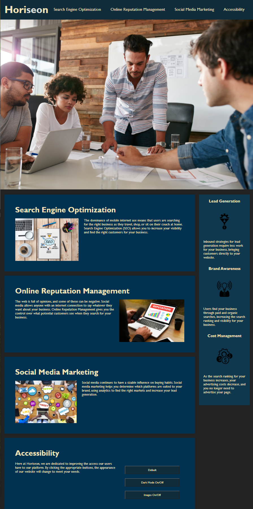
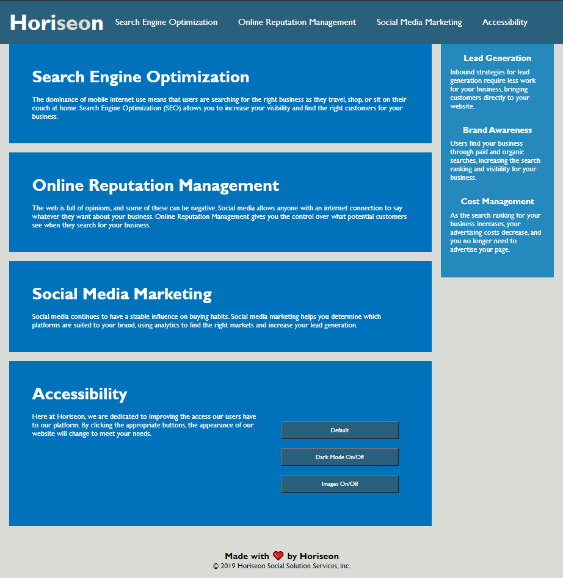
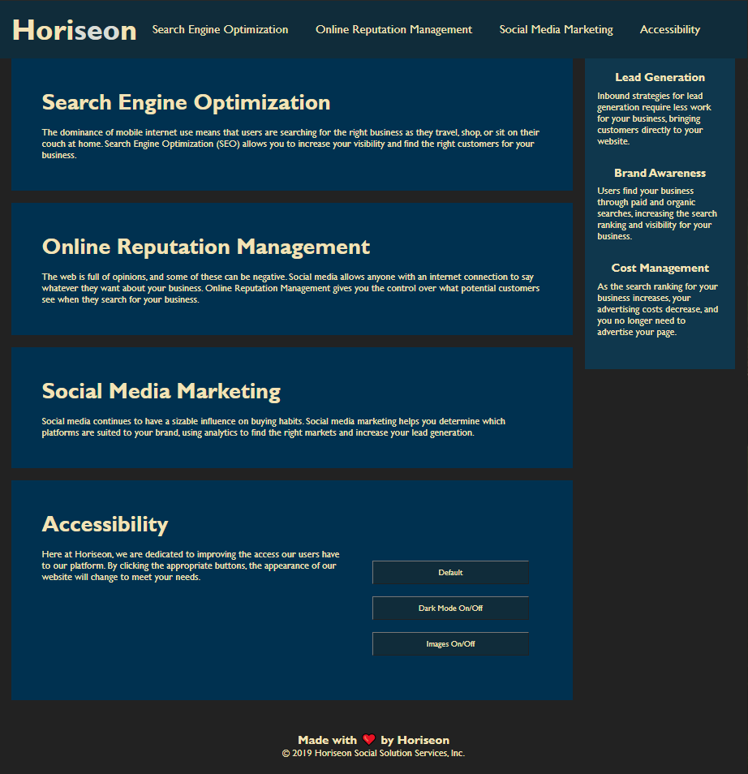

<h1 class="title"> Making HoriSEOn a More Accessible Client <h1>

## Overview
>One of the most important ways a company can reach more users is improving how accessibly they communicate. In this day and age, the front page of a company website may be the first place that company can communicate with a user. If the user finds the site difficult to access, they will certainly not hear all of what the company has to say to them, and they may simply give up on the company all together. Therefore, every company has a fiscal motivation and moral imperative to make their site as accessible as possible to the most people they can within the limits of their own time and budget.

&nbsp;

## HoriSEOn: A Brief History of a Media Giant 🌎
HoriSEOn has become a household name. It's about American as Wonder Bread or Ballpark brand hotdogs. Nary a day goes by I don't hum their infectious jingle to myself.

I am, of course, joking. HoriSEOn was a made up company in a homework assignment given to me by SMU's Coding Boot Camp. We were given the .html, .css, and images for this website:

------------

------------

The code provided was in a sad state. It looks good from out here, but there was a lot to get done. The first order of business was to devise a game plan. I didn't know how many of my ideas I could accomplish, or to what degree, but I was ultimately quite satisfied with how it turned out. 

&nbsp;

# The Plan:
1. The Basics
     * Make Sure the Site Works
     * Clean Up the Code
     * Finish the Assignment
2. Mobile Accessibility
3. Added Accessibility Features

&nbsp;

## The Basics

Don't let the title fool you, this part was not easy. And what's more, having promised myself I would go further on the assignment was a constant distraction. There were many times durring this process I had to stop myself and ask, "Is this really necessary to the assignment, or are you just having fun again?" This is a mindset and approach that I indulged only knowing it was the first assignment. I wanted to take the opportunity afforded a "first time" to test as many waters as I could get my hands on this early. I know that learning to curb these playful impulses is a skill I need to hone. That being said:

&nbsp;

### Make Sure the Site Works 

     This was straight forward. The only broken function was a missing `id=search-engine-optimization` at the correct paragraph to complete the link at the top of the page. 

### Clean Up the Code

     This was the majority of my time working on this assignment. Firstly, there were many places identical code was repeated in different classes in the .css file. These were all condensed into single classes. It was also very poorly organized; it was anyone's guess where you would find an element or class. I brought all related elements and classes together and added comments outlining the various sections. It was at this moment I became convinced there was more to improve on this code than I was capable of seeing. But for now, I pressed forward.

### Finish the Assignment

     The assignment was to make sure the code works, consolidate repeated code, and improve accessibility by adding semantic elements, a concise descriptive title, and specific descriptive alt= attribute. I went through and filled in the alt= attributes, called the site "Horiseon Main Page", and opened my final product in a browser to check it out. It didn't look very different, or different at all, and that was the point. 

&nbsp;

## Moblie Accessibility
However, I did notice at this time just how clunky it was as the window was made smaller even a little bit. This seemed to me to be an area I could improve accissibility for those who cannot afford computers and will be viewing the site on their phone. Optimizing the site for phone would also ensure the site behaved well if it was zoomed in for those with vision impairments. Noticing the problem was easy; fixing it was a struggle. I stumbled upon flex boxes a week before our class was tought it. With my limited understanding I managed to improve the site somewhat. The main `class=content` boxes now grew their height to cover all the text within them when the text wrapped due to small screen size. Messing with the navigation bar was much more difficult, but after struggling with it, it now switched from flex-row to flex-column from a media query `screen and (max-width: #)` (which we also hadn't learned about yet; YouTube has everything). Luckily, the week of the homework, we went over flex boxes and media queries, and I was able to fix some things I had missed, like the images sticking out the sides of the box when the screen was very small. Oh, and the most hilarious thing I fixed was simply removing the height attribute from the cover picture. Otherwise it was stretching inward and distorting dramatically. 

&nbsp;

## Added Accessibility Features
Improving accessibility to mobile devices got me thinking about what other ways I can improve accessibility for users with a variety of needs. After some research and a few YouTube videos, my attention was drawn to users with light sensitivity and users with autism. Unfortunately, fixes for these users require some major CSS changes and a bit of javascript, and more coding knowledge than I had at that time.

So I again went online and to YouTube and found [this video](https://youtu.be/AaVxSc11t3Y). It gave me the basics on how to implement CSS changes by clicking a button. After applying some elbow grease, I finally got a Default, Dark Mode, and Toggle Images button up and running. I improved it over the week, making sure it looked good on mobile, and the buttons were added to a new paragraph named "Accessibility" reasuring users that their needs would be met by Horiseon.

&nbsp;

# The Final Product

 

 

&nbsp;

Everything works as expected. I added new features that the "client" (assignment) didn't ask for, but I did it know they weren't a real client and because I really wanted to stretch myself and learn skills not yet covered in class. I feel good about where I got the website to, and I learned a lot about accessibility standards while doing it.

